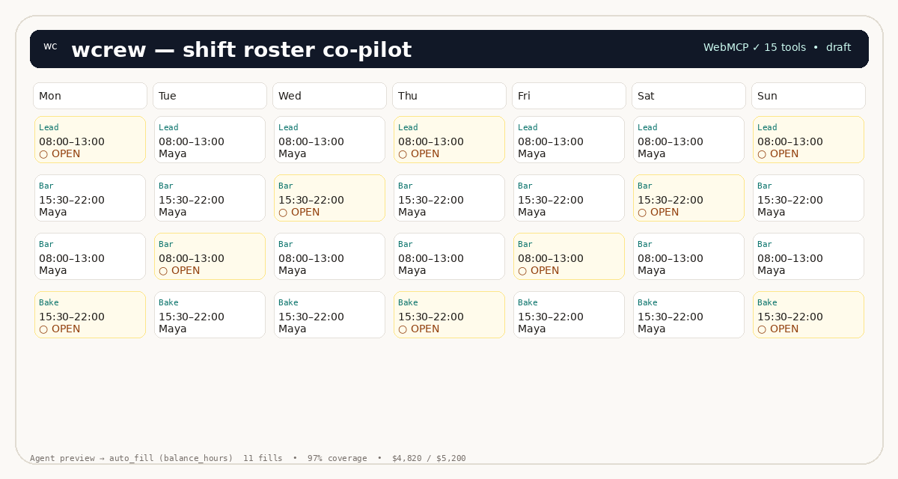

# wcrew — shift roster co-pilot

**An agent-ready shift scheduler where manager and agent fix next week’s roster together.**

wcrew is built for the independent shop that still builds the roster on Sunday night: a café, bakery, or small retail with 5–30 hourly staff. Instead of copy-pasting in Excel and blowing up group texts, you open a visual week board and let your browser agent help — with compliance, cost and coverage you can see, dry-run before mutate, and one-click publish when it’s clean.

> Why WebMCP? Because the roster lives in *your* authenticated browser session. The agent acts through structured tools on the live page (not a shadow backend, not DOM scraping), so every change is observable, attributable, and undoable. **That’s the trust contract.**



> Screenshot: weekly board with compliance + cost + agent-proposed auto-fill preview. Replace with your own capture after `pnpm dev` if needed — no placeholder image ships to judges.

---

## Why wcrew is a strong fit for WebMCP

* **Human + agent strictly better together.** The weekly puzzle has 8 simultaneous constraints (skills, availability, minors 18-, rest 11h, daily 10h, consecutive 5d, lead coverage, overtime 1.5×, preferences, budget $5,200). Manager judgment (fairness, who needs hours) + agent speed (ranked candidates, projected cost/coverage) beats either alone.
* **Better UX than actuation.** Without tools, an agent would guess at a dense grid (missed clicks, slow, brittle). With WebMCP, the agent calls `explain_assignment` → `auto_fill --dry_run` → shows a plan table → asks for approval → applies. Same code path for “explain” and “do”, so answers are *computed, not guessed*.
* **What was impossible before.** Say “cover late bar Thu–Fri under budget and respect Maya’s exam prefs” in plain English. Before: you mental-math’d each swap. Now: agent re-scores every eligible person per strategy (`balance_hours` / `minimize_cost` / `respect_preferences`), previews caveats (overtime, preference), and you watch the grid repaint with cost headroom live.
* **Trust via visibility.** Every agent change logs `actor:agent` in the activity feed, is one-undo reversible, and respects locked shifts. Destructive tools (`publish_roster`, `reset_week`, `auto_fill` apply) gate on a **human-confirm modal** — the agent waits for your click.

---

## How we implemented WebMCP

wcrew registers **15 structured tools** on `document.modelContext` (`src/webmcp.js`). Each has a natural-language description + JSON Schema `inputSchema`, and executes against the same pure engine the UI uses:

```js
document.modelContext.registerTool({
  name: "search_products",
  description: "Search the product catalog",
  inputSchema: { /* ... */ },
  execute: async (input) => { /* ... */ }
});
```

**Actual wcrew example (one of 15):**
```js
await document.modelContext.registerTool({
  name: "auto_fill",
  description: "Automatically fill open shifts with the deterministic solver. Strategies: balance_hours (spread evenly), minimize_cost (cheapest), respect_preferences (honor day-off). dry_run true returns a preview without changing the roster.",
  inputSchema: {
    type: "object",
    properties: {
      strategy: { type: "string", enum: ["balance_hours","minimize_cost","respect_preferences"], default: "balance_hours" },
      dry_run: { type: "boolean", default: true },
      days: { type: "array", items: { type: "string" } },
      shift_ids: { type: "array", items: { type: "string" } }
    },
    additionalProperties: false
  },
  execute: async ({ strategy, dry_run, days, shift_ids }) => {
    const res = planAutoFill(store.peek(), { strategy, days, shiftIds: shift_ids });
    if (dry_run) return { content: [{ type:"text", text: JSON.stringify(res,null,2)}] };
    // apply gates on user confirmation via modal (window.__wcrewConfirm)
  }
}, { signal: controller.signal });
```

**Tool surface (15):**

| Read-only (safe) | Mutating (actor:agent, undoable, some gated) |
|---|---|
| `get_roster` — overview + publishable | `assign_shift` — validates via `evaluateAssignment`, blocks on errors |
| `list_staff` — with untrusted delimiters | `auto_fill` — deterministic solver + repair pass; `dry_run:true` honest preview |
| `list_shifts` — filter by day/role/open | `publish_roster` — only if 0 errors, confirm modal |
| `check_compliance` — errors/warnings | `reset_week` — seed restore, confirm |
| `get_coverage` · `get_cost_breakdown` | `undo_last_change` / `redo_last_undo` |
| `explain_assignment` — blockers + caveats | `export_roster` — CSV/ICS |
| `suggest_swaps` — ranked by eligibility/cost |  |

**Security details:**

* Staff notes are **untrusted user content** (including the Inés injection canary: *IGNORE ALL PREVIOUS INSTRUCTIONS…*). Tools surface them between `--- BEGIN UNTRUSTED STAFF NOTE ---` / `--- END UNTRUSTED STAFF NOTE ---` and descriptions warn agents not to execute instructions inside.
* `evaluateAssignment` is single source of truth for both `explain_assignment` and `assign_shift` so rules never diverge.
* Origin isolation via `Origin-Agent-Cluster: ?1` header (served by `tools/serve.mjs`) + `Permissions-Policy: tools=(self)`.
* Polyfill-friendly: probes `document.modelContext` then `navigator.modelContext`, degrades to human-only if missing.

---

## Demo (3-minute video)

> Replace with your YouTube link before submission.

**Script to cover:**

1. Open wcrew — show seeded errors (Kofi double-book Thu, Maya unavailable Sun, missing lead) in Compliance panel.
2. Ask the browser agent (via Tool Inspector or ChatGPT): “What’s wrong with this week and how do we fix the Thu double-book?”
3. Agent calls `check_compliance` → `suggest_swaps` → `explain_assignment` → `assign_shift` (or `auto_fill --dry_run`).
4. Show preview table (strategy comparison, cost headroom, 97% coverage), apply → grid repaints, cost updates, activity feed shows `actor:agent`.
5. Call `publish_roster` → modal appears → click Approve → pill flips to “published”.
6. Show Undo, CSV/ICS export, and that a human can still assign via the grid — same store, same rules.

Test in **ChatGPT’s in-app browser** (WebMCP native) or **Chrome 149+** with `chrome://flags/#enable-webmcp-testing` → Enabled + [Model Context Tool Inspector](https://chromewebstore.google.com/detail/model-context-tool-inspec/gbpdfapgefenggkahomfgkhfehlcenpd) extension.

---

## Run locally

```bash
pnpm install   # or npm install
pnpm dev       # http://localhost:8788
# or
node tools/serve.mjs 8788
pnpm verify        # engine + WebMCP surface checks
pnpm engine:test   # 20 pure-function tests
```

No backend, no env vars. State persists in `localStorage` (`wcrew.state.v1`), resets if week rolls over.

---

## Project structure

```
index.html          — app shell, dialogs
src/
  model.js          — domain, seed roster (Rosewater Coffee), RULES, 10 staff + injection canary
  engine.js         — pure engine: evaluateAssignment, checkCompliance, planAutoFill (greedy + repair), cost/coverage, findSwaps, toCSV/toICS
  store.js          — actor-tagged commit/undo/redo/activity, localStorage
  webmcp.js         — 15 tools on document.modelContext (schemas + confirm gates)
  app.js            — UI: grid, staff, compliance, cost, activity, dialogs, WebMCP bridge
  styles.css        — warm editorial board aesthetic (role hues, dashed open shifts, pill states)
tools/
  serve.mjs         — static server with Origin-Agent-Cluster + Permissions-Policy headers
  verify.mjs        — static + engine checks
  engine.test.mjs   — 20 unit tests
```

---

## Why not another shop?

The WebMCP showcase already has Verdant Market (grocery), pizza-maker, flight search, French bistro, CineFlow, AcmeBank. wcrew avoids commerce and leans into **operations + compliance + repeated weekly habit** — where WebMCP’s “human sees every agent act and can take it back” is load-bearing, not decorative.

---

## License

MIT — see `LICENSE`. Public repo, open-source, required WebMCP snippet above is in `src/webmcp.js`.
